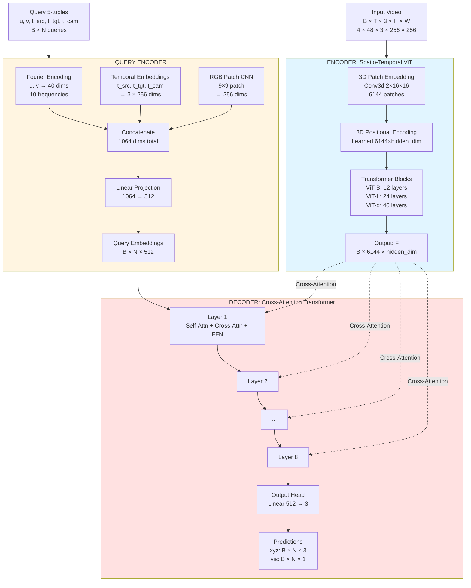
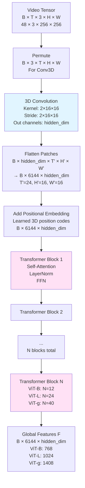
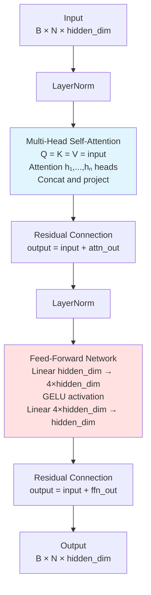
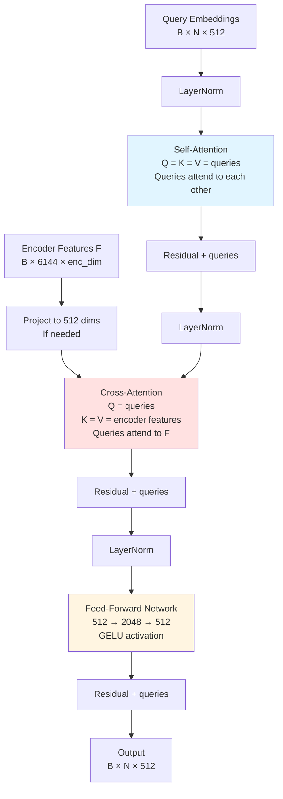
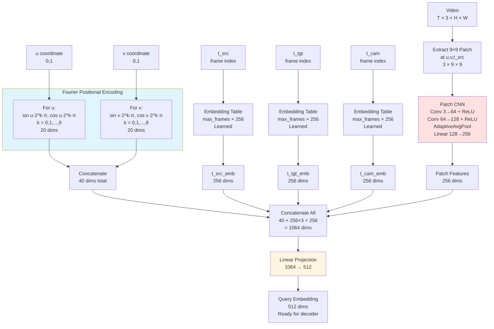
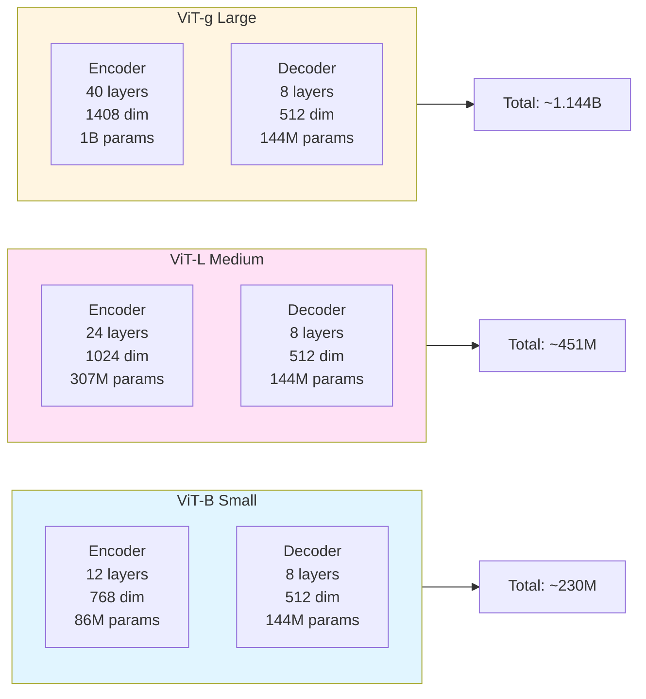

# D4RT Architecture Flowchart

## Overall Model Architecture

## Encoder Detail: Spatio-Temporal ViT

## Transformer Block Detail

## Decoder Detail: Cross-Attention Layer

## Query Encoding Detail

## Model Size Comparison

