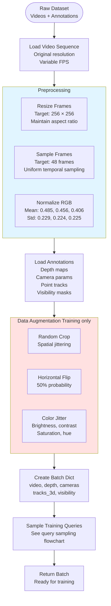
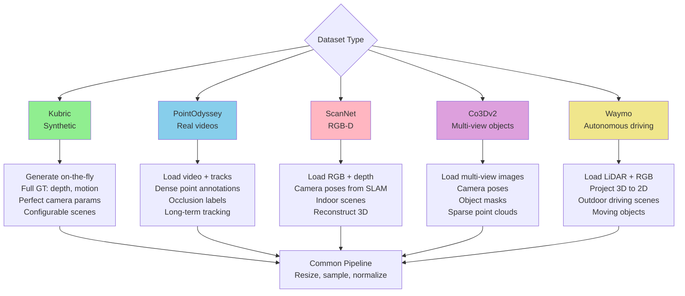
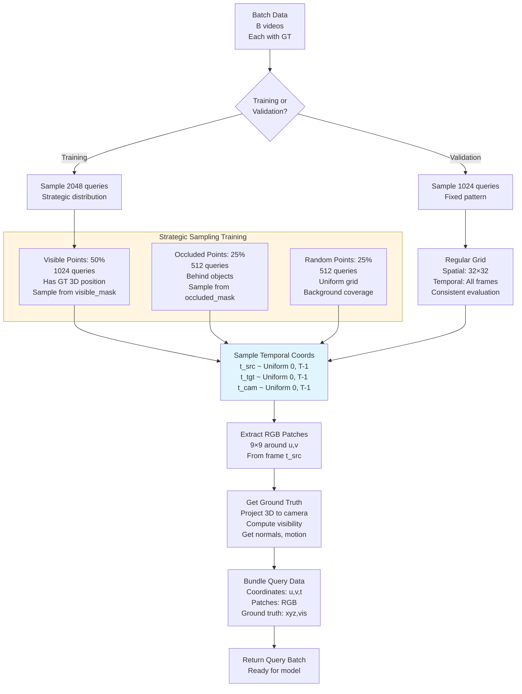
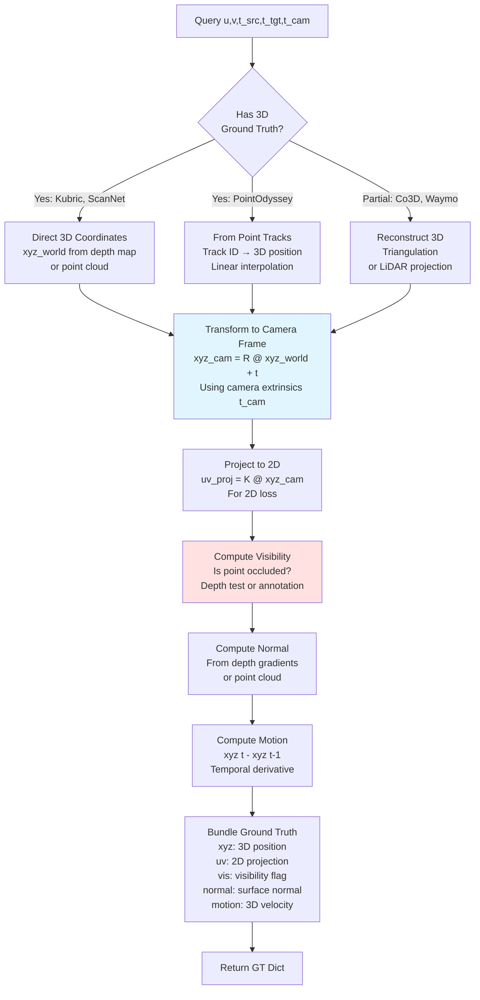
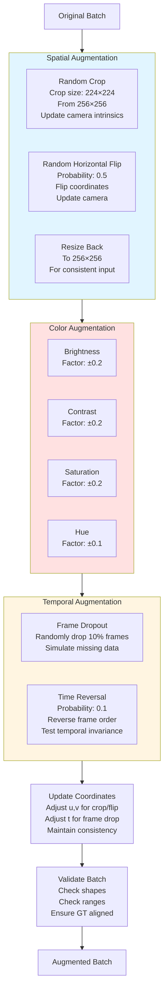
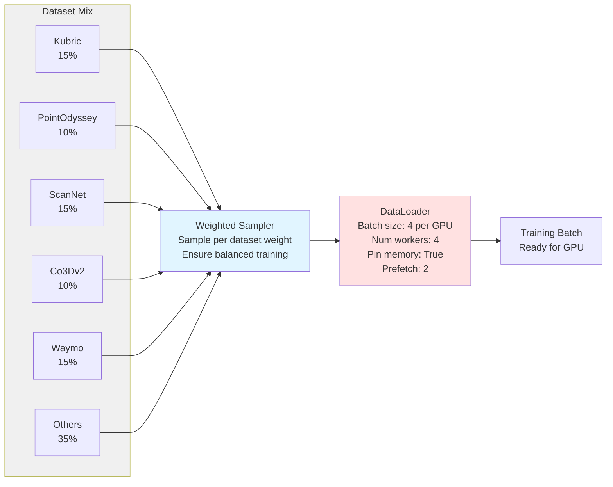
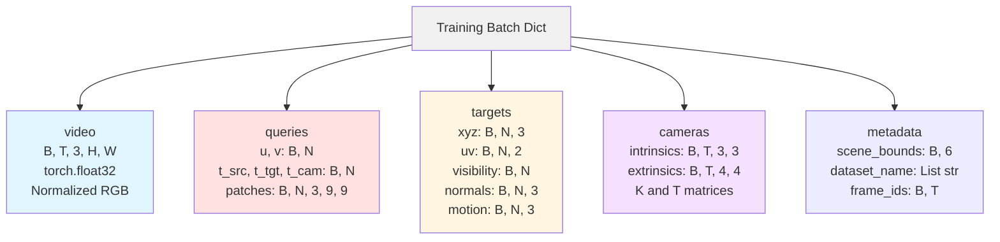

# D4RT Data Pipeline Flowchart

## Overall Data Pipeline

## Dataset-Specific Pipelines

## Query Sampling Strategy

## Ground Truth Extraction

## Data Augmentation

## Dataloader Configuration

## Batch Structure

