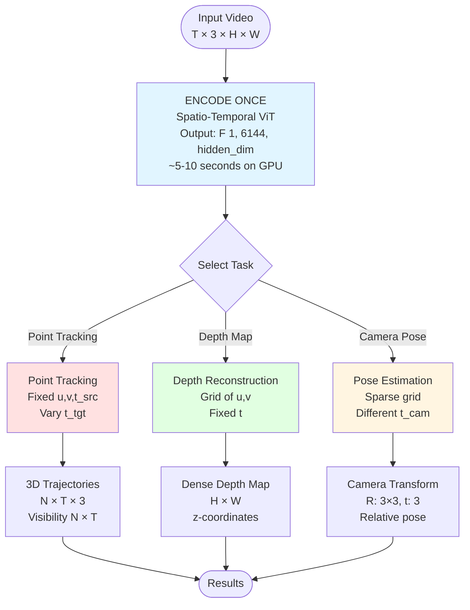
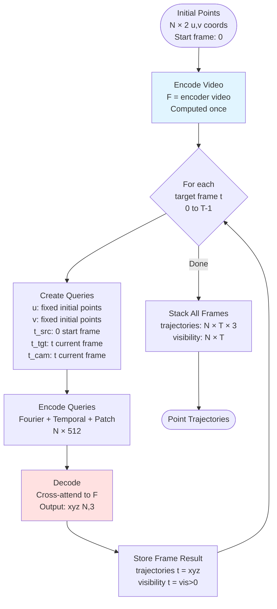
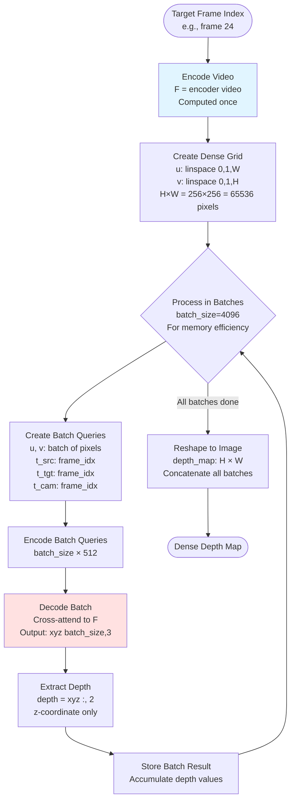
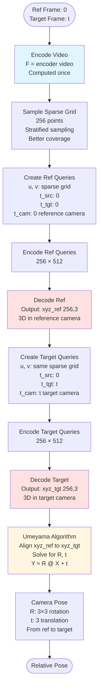
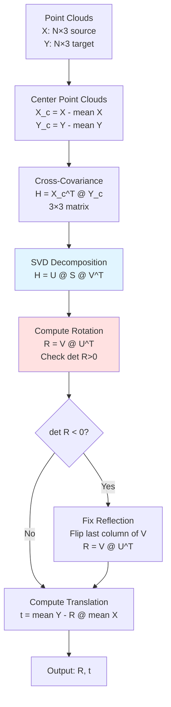

# D4RT Inference Flowchart

## Overall Inference Pipeline

```mermaid
flowchart TD
    Start([Input Video<br/>T × 3 × H × W]) --> Encode[ENCODE ONCE<br/>Spatio-Temporal ViT<br/>Output: F 1, 6144, hidden_dim<br/>~5-10 seconds on GPU]

    Encode --> TaskSelect{Select Task}

    TaskSelect -->|Point Tracking| Track[Point Tracking<br/>Fixed u,v,t_src<br/>Vary t_tgt]
    TaskSelect -->|Depth Map| Depth[Depth Reconstruction<br/>Grid of u,v<br/>Fixed t]
    TaskSelect -->|Camera Pose| Pose[Pose Estimation<br/>Sparse grid<br/>Different t_cam]

    Track --> TrackResult[3D Trajectories<br/>N × T × 3<br/>Visibility N × T]
    Depth --> DepthResult[Dense Depth Map<br/>H × W<br/>z-coordinates]
    Pose --> PoseResult[Camera Transform<br/>R: 3×3, t: 3<br/>Relative pose]

    TrackResult --> End([Results])
    DepthResult --> End
    PoseResult --> End

    style Encode fill:#e1f5ff
    style Track fill:#ffe1e1
    style Depth fill:#e1ffe1
    style Pose fill:#fff5e1
```

## Task 1: Point Tracking

```mermaid
flowchart TD
    Start([Initial Points<br/>N × 2 u,v coords<br/>Start frame: 0]) --> Encode[Encode Video<br/>F = encoder video<br/>Computed once]

    Encode --> Loop{For each<br/>target frame t<br/>0 to T-1}

    Loop --> CreateQueries[Create Queries<br/>u: fixed initial points<br/>v: fixed initial points<br/>t_src: 0 start frame<br/>t_tgt: t current frame<br/>t_cam: t current frame]

    CreateQueries --> EncodeQueries[Encode Queries<br/>Fourier + Temporal + Patch<br/>N × 512]

    EncodeQueries --> Decode[Decode<br/>Cross-attend to F<br/>Output: xyz N,3]

    Decode --> StoreFrame[Store Frame Result<br/>trajectories t = xyz<br/>visibility t = vis>0]

    StoreFrame --> Loop

    Loop -->|Done| Stack[Stack All Frames<br/>trajectories: N × T × 3<br/>visibility: N × T]

    Stack --> End([Point Trajectories])

    style Encode fill:#e1f5ff
    style Decode fill:#ffe1e1
```

## Task 2: Dense Depth Reconstruction

```mermaid
flowchart TD
    Start([Target Frame Index<br/>e.g., frame 24]) --> Encode[Encode Video<br/>F = encoder video<br/>Computed once]

    Encode --> CreateGrid[Create Dense Grid<br/>u: linspace 0,1,W<br/>v: linspace 0,1,H<br/>H×W = 256×256 = 65536 pixels]

    CreateGrid --> Batch{Process in Batches<br/>batch_size=4096<br/>For memory efficiency}

    Batch --> CreateBatchQueries[Create Batch Queries<br/>u, v: batch of pixels<br/>t_src: frame_idx<br/>t_tgt: frame_idx<br/>t_cam: frame_idx]

    CreateBatchQueries --> EncodeBatch[Encode Batch Queries<br/>batch_size × 512]

    EncodeBatch --> DecodeBatch[Decode Batch<br/>Cross-attend to F<br/>Output: xyz batch_size,3]

    DecodeBatch --> ExtractDepth[Extract Depth<br/>depth = xyz :, 2<br/>z-coordinate only]

    ExtractDepth --> StoreBatch[Store Batch Result<br/>Accumulate depth values]

    StoreBatch --> Batch

    Batch -->|All batches done| Reshape[Reshape to Image<br/>depth_map: H × W<br/>Concatenate all batches]

    Reshape --> End([Dense Depth Map])

    style Encode fill:#e1f5ff
    style DecodeBatch fill:#ffe1e1
```

## Task 3: Camera Pose Estimation

```mermaid
flowchart TD
    Start([Ref Frame: 0<br/>Target Frame: t]) --> Encode[Encode Video<br/>F = encoder video<br/>Computed once]

    Encode --> SampleGrid[Sample Sparse Grid<br/>256 points<br/>Stratified sampling<br/>Better coverage]

    SampleGrid --> RefQueries[Create Ref Queries<br/>u, v: sparse grid<br/>t_src: 0<br/>t_tgt: 0<br/>t_cam: 0 reference camera]

    RefQueries --> EncodeRef[Encode Ref Queries<br/>256 × 512]

    EncodeRef --> DecodeRef[Decode Ref<br/>Output: xyz_ref 256,3<br/>3D in reference camera]

    DecodeRef --> TgtQueries[Create Target Queries<br/>u, v: same sparse grid<br/>t_src: 0<br/>t_tgt: t<br/>t_cam: t target camera]

    TgtQueries --> EncodeTgt[Encode Target Queries<br/>256 × 512]

    EncodeTgt --> DecodeTgt[Decode Target<br/>Output: xyz_tgt 256,3<br/>3D in target camera]

    DecodeTgt --> Umeyama[Umeyama Algorithm<br/>Align xyz_ref to xyz_tgt<br/>Solve for R, t<br/>Y ≈ R @ X + t]

    Umeyama --> Result[Camera Pose<br/>R: 3×3 rotation<br/>t: 3 translation<br/>From ref to target]

    Result --> End([Relative Pose])

    style Encode fill:#e1f5ff
    style DecodeRef fill:#ffe1e1
    style DecodeTgt fill:#ffe1e1
    style Umeyama fill:#fff5e1
```

## Umeyama Algorithm Detail

```mermaid
flowchart TD
    Start[Point Clouds<br/>X: N×3 source<br/>Y: N×3 target] --> Center[Center Point Clouds<br/>X_c = X - mean X<br/>Y_c = Y - mean Y]

    Center --> Covariance[Cross-Covariance<br/>H = X_c^T @ Y_c<br/>3×3 matrix]

    Covariance --> SVD[SVD Decomposition<br/>H = U @ S @ V^T]

    SVD --> Rotation[Compute Rotation<br/>R = V @ U^T<br/>Check det R>0]

    Rotation --> CheckReflection{det R < 0?}
    CheckReflection -->|Yes| FixReflection[Fix Reflection<br/>Flip last column of V<br/>R = V @ U^T]
    CheckReflection -->|No| Translation
    FixReflection --> Translation

    Translation[Compute Translation<br/>t = mean Y - R @ mean X]

    Translation --> End[Output: R, t]

    style SVD fill:#e1f5ff
    style Rotation fill:#ffe1e1
```
