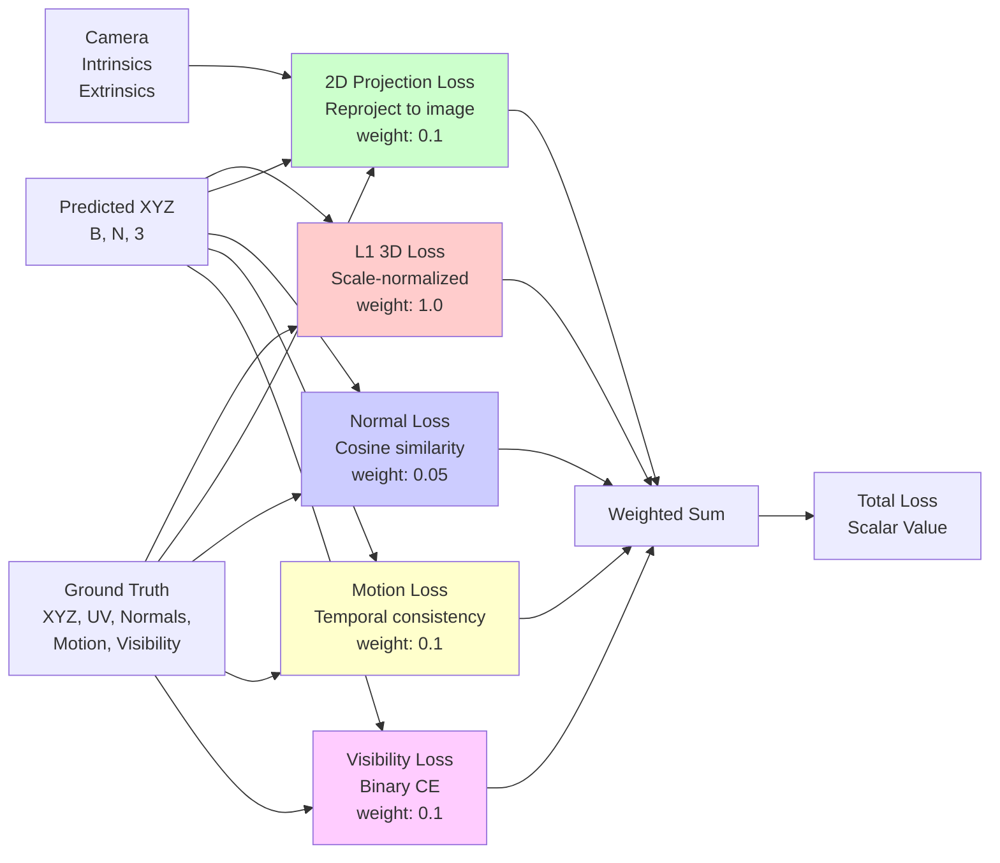
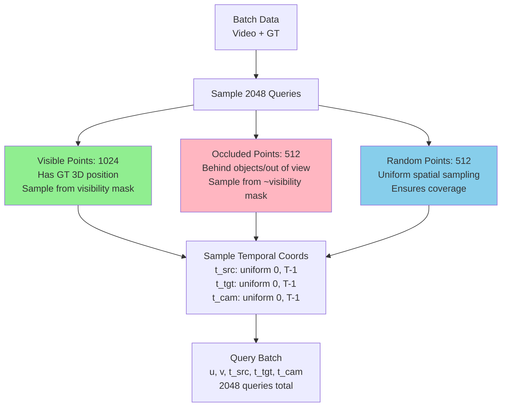

# D4RT Training Flowchart

## Complete Training Loop

```mermaid
flowchart TD
    Start([Start Training]) --> LoadBatch[Load Video Batch<br/>B, T, C, H, W<br/>4 × 48 × 3 × 256 × 256]

    LoadBatch --> Encode[ENCODER: Spatio-Temporal ViT<br/>3D Patching: 2×16×16<br/>40 Transformer Layers<br/>Output: F B, 6144, 1408]

    Encode --> SampleQueries[SAMPLE QUERIES<br/>2048 queries per batch<br/>50% visible<br/>25% occluded<br/>25% random]

    SampleQueries --> EncodeQueries[ENCODE QUERIES<br/>Fourier u,v: 40 dims<br/>Temporal t_src, t_tgt, t_cam: 768 dims<br/>RGB Patch 9×9: 256 dims<br/>Project to 512 dims]

    EncodeQueries --> Decode[DECODER: Cross-Attention<br/>8 Layers, 512 hidden dim<br/>Self-Attention + Cross-Attention to F<br/>Output: xyz B, 2048, 3]

    Decode --> ComputeLosses[COMPUTE LOSSES<br/>L1 3D: weight 1.0<br/>2D Projection: weight 0.1<br/>Surface Normal: weight 0.05<br/>Motion: weight 0.1<br/>Visibility: weight 0.1]

    ComputeLosses --> Backward[BACKWARD PASS<br/>Compute gradients<br/>Clip gradients max_norm=1.0]

    Backward --> Optimize[OPTIMIZER STEP<br/>AdamW lr=1e-4<br/>Weight Decay: 0.05<br/>Update Parameters]

    Optimize --> CheckLog{Log Metrics?<br/>step % 100 == 0}
    CheckLog -->|Yes| LogMetrics[Log to WandB<br/>Loss values<br/>Gradient norms<br/>Learning rate]
    CheckLog -->|No| CheckSave
    LogMetrics --> CheckSave

    CheckSave{Save Checkpoint?<br/>step % 1000 == 0}
    CheckSave -->|Yes| SaveCheckpoint[Save Model State<br/>Optimizer State<br/>Step Counter<br/>Best Val Loss]
    CheckSave -->|No| CheckDone
    SaveCheckpoint --> CheckDone

    CheckDone{Training Complete?<br/>step >= max_steps}
    CheckDone -->|No| LoadBatch
    CheckDone -->|Yes| End([End Training])

    style Encode fill:#e1f5ff
    style Decode fill:#ffe1e1
    style ComputeLosses fill:#fff5e1
    style Optimize fill:#e1ffe1
```

## Loss Computation Detail

```mermaid
flowchart LR
    Pred[Predicted XYZ<br/>B, N, 3] --> Loss1
    Pred --> Loss2
    Pred --> Loss3
    Pred --> Loss4
    Pred --> Loss5

    GT[Ground Truth<br/>XYZ, UV, Normals,<br/>Motion, Visibility] --> Loss1
    GT --> Loss2
    GT --> Loss3
    GT --> Loss4
    GT --> Loss5

    Cam[Camera<br/>Intrinsics<br/>Extrinsics] --> Loss2

    Loss1[L1 3D Loss<br/>Scale-normalized<br/>weight: 1.0]
    Loss2[2D Projection Loss<br/>Reproject to image<br/>weight: 0.1]
    Loss3[Normal Loss<br/>Cosine similarity<br/>weight: 0.05]
    Loss4[Motion Loss<br/>Temporal consistency<br/>weight: 0.1]
    Loss5[Visibility Loss<br/>Binary CE<br/>weight: 0.1]

    Loss1 --> Sum[Weighted Sum]
    Loss2 --> Sum
    Loss3 --> Sum
    Loss4 --> Sum
    Loss5 --> Sum

    Sum --> Total[Total Loss<br/>Scalar Value]

    style Loss1 fill:#ffcccc
    style Loss2 fill:#ccffcc
    style Loss3 fill:#ccccff
    style Loss4 fill:#ffffcc
    style Loss5 fill:#ffccff
```

## Query Sampling Strategy

```mermaid
flowchart TD
    Start[Batch Data<br/>Video + GT] --> Sample

    Sample[Sample 2048 Queries] --> Visible
    Sample --> Occluded
    Sample --> Random

    Visible[Visible Points: 1024<br/>Has GT 3D position<br/>Sample from visibility mask]
    Occluded[Occluded Points: 512<br/>Behind objects/out of view<br/>Sample from ~visibility mask]
    Random[Random Points: 512<br/>Uniform spatial sampling<br/>Ensures coverage]

    Visible --> Temporal
    Occluded --> Temporal
    Random --> Temporal

    Temporal[Sample Temporal Coords<br/>t_src: uniform 0, T-1<br/>t_tgt: uniform 0, T-1<br/>t_cam: uniform 0, T-1]

    Temporal --> Output[Query Batch<br/>u, v, t_src, t_tgt, t_cam<br/>2048 queries total]

    style Visible fill:#90EE90
    style Occluded fill:#FFB6C1
    style Random fill:#87CEEB
```
