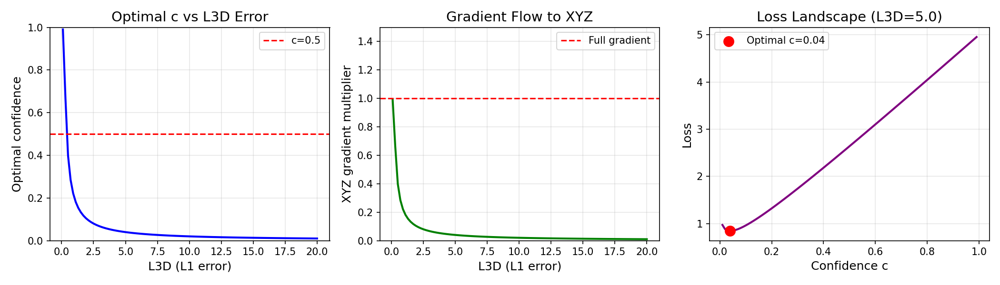

# Implementation Notes

This document describes the differences between our implementation and the original D4RT paper, including fixes and improvements discovered during development.

## Table of Contents

1. [Loss Function](#loss-function)
2. [Confidence Warmup](#confidence-warmup)
3. [Depth Variance Collapse](#depth-variance-collapse)
4. [UV Coordinate Normalization](#uv-coordinate-normalization)
5. [Gradient Clipping](#gradient-clipping)
6. [Architecture Notes](#architecture-notes)

---

## Loss Function

### Paper Formula

The D4RT paper uses a confidence-weighted loss based on [Kendall & Gal (2017)](https://arxiv.org/abs/1703.04977):

```
L = (1/N) Σ [c·λ3D·L3D - λconf·log(c) + λ2D·L2D + λvis·Lvis + λdisp·Ldisp + λnormal·Lnormal]
```

Where:
- `c` = predicted confidence (sigmoid output)
- `L3D` = L1 loss on normalized 3D positions (with signed-log transform)
- `-log(c)` = confidence penalty (prevents c→0)

### Loss Weights

| Weight | Value | Description |
|--------|-------|-------------|
| λ3D | 1.0 | Primary 3D supervision |
| λ2D | 0.1 | 2D coordinate L2 loss |
| λvis | 0.1 | Visibility BCE loss |
| λdisp | 0.1 | Motion displacement L1 loss |
| λconf | 0.2 | Confidence penalty |
| λnormal | 0.5 | Surface normal cosine loss |

### 3D Loss Normalization

The paper applies two transformations to 3D positions before computing L1 loss:
1. **Mean depth normalization**: Divide by mean GT depth
2. **Signed-log transform**: `sign(x) · log(1 + |x|)`

This dampens the influence of far-away points.

---

## Confidence Warmup

### Problem: Confidence Exploitation

We discovered that the confidence-weighted loss allows the model to minimize loss by outputting low confidence instead of learning accurate 3D predictions.

**Mathematical Analysis:**

The optimal confidence that minimizes the loss is:
```
c_optimal = 1 / L3D  (from Kendall & Gal)
```

For an untrained model with L3D ≈ 5:
- c_optimal ≈ 0.2
- XYZ gradient is multiplied by c ≈ 0.2, significantly reduced

**Observed Symptoms (after 50k training steps without fix):**
- Mean confidence: 0.37 (uniformly low across all samples)
- Prediction scale ratio: 0.03 (predictions collapsed to narrow range)
- AJ = 0, APD3D = 0 (no actual 3D learning)

### Solution: Confidence Warmup Schedule

We added a warmup period where confidence weighting is disabled:

```python
# During warmup: c_effective = 1 (full gradients to xyz)
# After warmup: c_effective = learned c

if step < confidence_warmup_steps:
    c_effective = 1.0 * (1 - step/warmup_steps) + c * (step/warmup_steps)
else:
    c_effective = c
```

**Key insight**: This is consistent with how uncertainty learning is typically done - first train the base model, then add uncertainty estimation.

**Results with warmup (500 steps):**
- Mean confidence: 0.9999 (high, honest confidence)
- Prediction scale ratio: 0.34 (11x improvement)
- Model actually learning 3D predictions

### Configuration

```yaml
# configs/training/train_paper_arch.yaml
confidence_warmup_steps: 25000  # Half of total training
```

### Analysis Visualization



The plots show:
1. **Left**: Higher L3D error → lower optimal confidence
2. **Middle**: XYZ gradient multiplier drops to near-zero for high L3D
3. **Right**: Loss minimum at very low confidence

---

## Depth Variance Collapse

### Problem

Scale-invariant 3D losses (both paper's independent normalization and DUSt3R's joint normalization) allow the model to minimize loss by predicting all depths near the mean value. This is because after normalization, predictions clustered around the mean have small errors.

**Observed symptoms** (training with `depth: 0.0`):
- `pred_z_std = 0.78` vs `gt_z_std = 2.62` (30% of expected variance)
- Z correlation = 0.39 (low depth accuracy)
- Good XY tracking (corr > 0.5) but poor depth

### Solution: Direct Depth Loss

Add an absolute L1 depth loss that is NOT scale-invariant:

```python
L_depth = |pred_z - gt_z|
```

**Configuration:**
```yaml
loss_weights:
  depth: 1.0  # Direct L1 depth loss weight
```

**Results after enabling depth loss:**

| Step | Z corr | pred_z std | gt_z std |
|------|--------|------------|----------|
| 19000 (depth=0) | 0.359 | 0.74 | 3.15 |
| 20000 (depth=1) | 0.409 | 0.92 | 3.12 |

Z correlation and variance improved after just 1k steps with depth loss enabled.

### Why This Works

The direct depth loss provides a gradient signal proportional to the absolute depth error, regardless of scale normalization. This encourages the model to:
1. Predict the correct depth distribution (matching GT variance)
2. Learn absolute depth values, not just relative ordering

---

## UV Coordinate Normalization

### Problem

We discovered a mismatch between GT UV coordinates and model output:
- **GT UV**: Pixel coordinates [0, H-1] × [0, W-1]
- **Model output**: Normalized [0, 1] via sigmoid

This caused the 2D loss to dominate (~3000 out of ~3085 total loss).

### Fix

Normalize GT UV to [0, 1] range in `d4rt/data/query_sampling.py`:

```python
# Normalize UV to [0, 1] to match model's sigmoid output
uv_normalized = uv.clone()
uv_normalized[:, 0] = uv[:, 0] / (W - 1)
uv_normalized[:, 1] = uv[:, 1] / (H - 1)
```

---

## Gradient Clipping

### Paper Specification

From the paper:
> "Gradients are clipped to a maximum L2-norm of 10."

### Configuration

```yaml
# configs/training/train_paper_arch.yaml
clip_grad_norm: 10.0  # Paper specifies max L2-norm of 10
```

---

## Architecture Notes

### Encoder Block Structure

The paper's Figure 7 shows each encoder block contains **BOTH** attention types:
1. Per-Frame Self-Attention (local) → MLP
2. Global Self-Attention → MLP

This is different from some implementations that alternate between local and global attention across layers.

**Why both per block?**
- Local attention preserves spatial diversity within each frame
- Global attention enables cross-frame temporal reasoning
- Having both in each block prevents token homogenization

### Aspect Ratio Token

Per paper p.3:
> "We embed [aspect ratio] into a separate token and pass it to the transformer along with the main video tokens."

Key details:
- Input: Scalar W/H ratio
- Embedding: FC layer (1 → 768)
- **NO positional encoding** for AR token (only video tokens get PE)
- AR token participates in global attention only, not local per-frame attention

### Patch Normalization

We found that adding LayerNorm after patch embedding can cause spatial information loss (brightness/intensity becomes uniform). The paper doesn't mention patch normalization, so we disable it by default.

```yaml
# configs/model/vit_b_d4rt.yaml
encoder:
  use_patch_norm: false  # Preserves brightness information
```

---

## Debug Scripts

Several debug scripts were created during development:

| Script | Purpose |
|--------|---------|
| `scripts/debug_train_simple_l1.py` | Train with simple L1 loss (no confidence) |
| `scripts/debug_train_with_warmup.py` | Train with confidence warmup |
| `scripts/debug_eval_outputs.py` | Analyze model outputs vs GT |
| `scripts/debug_analyze_confidence_gradient.py` | Visualize confidence exploitation |

---

## References

1. [D4RT Paper](https://arxiv.org/html/2512.08924v1)
2. [Kendall & Gal (2017)](https://arxiv.org/abs/1703.04977) - "What Uncertainties Do We Need in Bayesian Deep Learning for Computer Vision?"
3. [VideoMAE](https://github.com/MCG-NJU/VideoMAE) - Pretrained encoder weights
